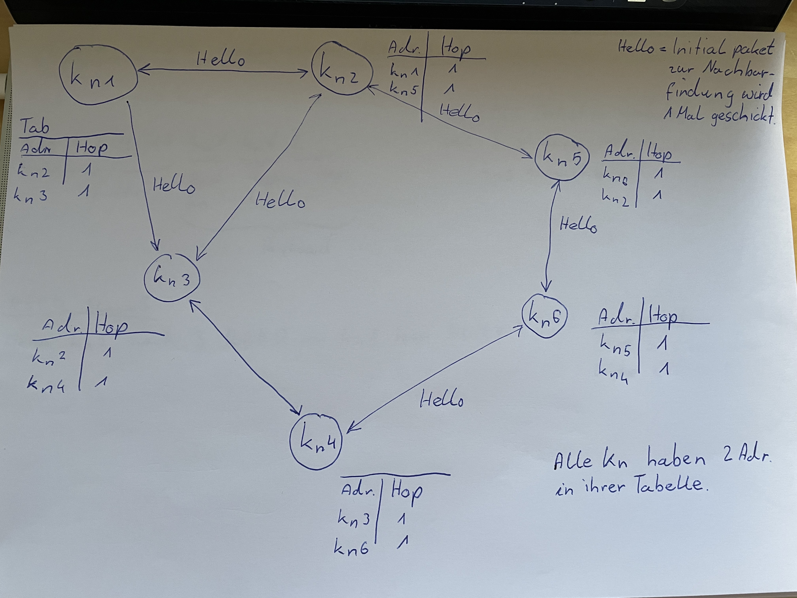

# Protokoll
Spezifikation für unser Protokoll im Kurs TmS

### Netzwerkstruktur

### Network discovery
Nach der Knofiguration sendet der Knoten1 initial ein broadcast (z.B. alle 10 Sekunden bis 1 Adresse in der Tabelle steht) an alle erreichbaren Knoten bspw. Knoten2 und Knoten3 gleiches gilt umgekehrt Knoten2 u. 3 senden initial ein Hello an Knoten1 somit hat Knoten1 zwei Nachbarn. Eine trafficarme und sinnvolle Möglichkeit die aktive Route zu den Nachbarn zu halten (AODV RFC 6.9.), wäre mit intervallmäßigen Hello Paketen (alle 50 Sekunden). Diese Pakete sollen nicht weitergeroutet werden sondern sind nur für direkte Nachbarn gedacht (evtl. könnte die payload auch leer sein, da diese Pakete auch anhand des Flags erkannt werden). 

### Nachrichtenversand
#### Route Request (Flag=3)
Knoten1 will an Knoten6 eine Nachricht schicken\

Dafür sendet Kn1 an Kn2 und Kn3 ein Route Request in folgendem Format:\

RouteRequest Beispiel fur Kn1:\
Source = Kn1\
Dest = Kn2\
F = Flag = 3,\
T = TTL=10\
EKn = Kn6\
Ursp = Kn1\
H = Hops=0\

+-+-+-+-+-+-+-+-+-+-+-+-+-+-+-+-+-+-+-|\
| Source|  Dest |F|T| EKn   |  Ursp |H|\
+-+-+-+-+-+-+-+-+-+-+-+-+-+-+-+-+-+-+-+\

RouteRequest Beispiel fur Kn5:\
Source = Kn2\
Dest = Kn5\
F = Flag = 3,\
T = TTL=9\
EKn = Kn6\
Ursp = Kn1\
H = Hops=2\

+-+-+-+-+-+-+-+-+-+-+-+-+-+-+-+-+-+-+-|\
| Source|  Dest |F|T| EKn   |  Ursp |H|\
+-+-+-+-+-+-+-+-+-+-+-+-+-+-+-+-+-+-+-+\

#### Route Reply wäre unser ACK Paket (Flag=4)
Knoten6 schickt an Knoten1 ein Route Reply zurück.\

RouteReply Beispiel fur Kn6:\
Source = Kn6\
Dest = Kn5\
F = Flag = 4\
T = TTL=10\
EKn = Kn1\
Ursp = Kn6\
H = Hops=2\

+-+-+-+-+-+-+-+-+-+-+-+-+-+-+-+-+-+-+-|\
| Source|  Dest |F|T| EKn   |  Ursp |H|\
+-+-+-+-+-+-+-+-+-+-+-+-+-+-+-+-+-+-+-+\

Kn2 Kann dann Kn6 in Tabelle eintragen, da Kn2 jetzt weiss irgendwo ist Kn6 und ihn kann ich über Kn5 erreichen.\

#### Route Error

Wenn Knoten2 nach 3 Route Requests an Knoten5 kein Route Reply bekommt wird Knoten5 aus der Tabelle gelöscht.\

#### Route Tabelle
Die Tabelle die jeder Knoten verwaltet müsste somit folgende Einträge haben:
* Adresse des Zielknotens  
* Adresse des nächsten Hops (Nachbarknoten)   
* Hops (Qualität der Route)  
 